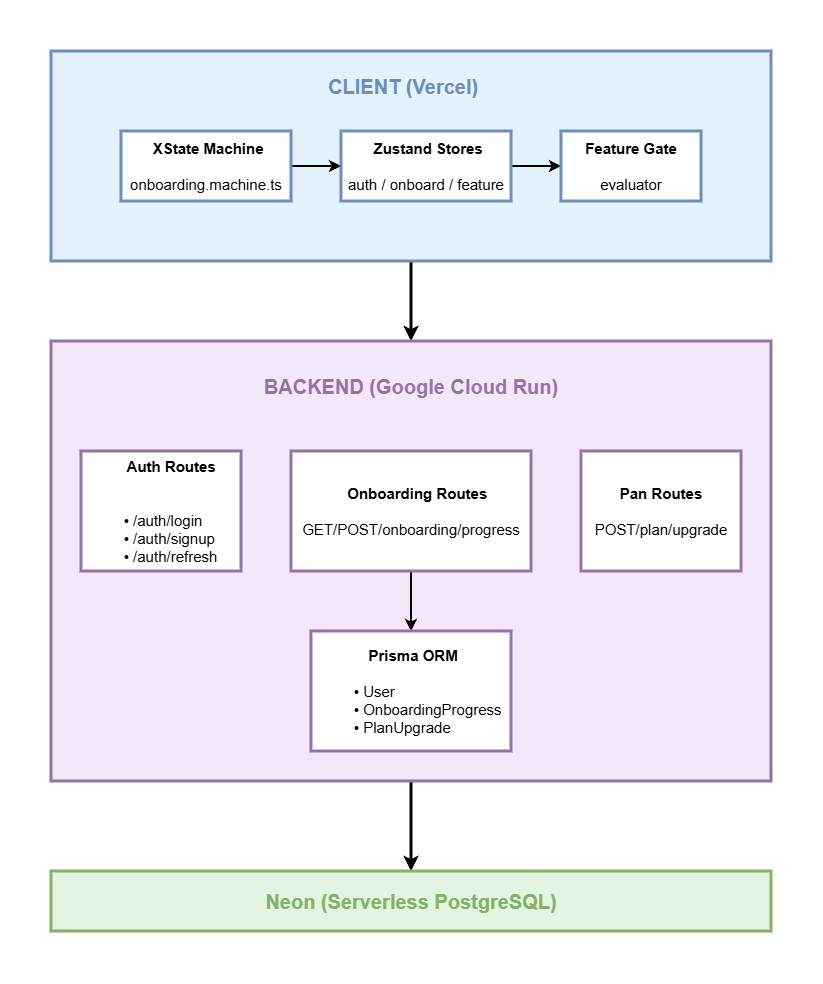

# Pipeflow — Onboarding Flow with Feature Gating

Most SaaS tools drop new users on a blank screen and hope they figure it out. The result is high churn in the first session — users never reach the moment where the product clicks. Pipeflow is a B2B project management SaaS that solves this with a guided activation loop: every new user is walked through a personalised setup flow, and features unlock progressively as they complete each step and upgrade their plan.

This project was built to demonstrate the kind of product engineering that drives activation metrics — state machines, feature gating, progress persistence, and plan-based access control — patterns used in production at companies like Linear, Notion, and Amplitude.

---

## Live Demo

| | |
|---|---|
| **Frontend** | https://pipeflow-onboarding-flow-with-featu.vercel.app |
| **Backend API** | https://pipeflow-api-bjee34ye2a-uc.a.run.app/health |

### Demo Accounts

| Email | Password | Plan | What to look for |
|---|---|---|---|
| `starter@demo.com` | `Demo1234!` | Starter | Full onboarding flow from Step 1, features locked until steps complete |
| `growth@demo.com` | `Demo1234!` | Growth | Dashboard with resume banner at 75%, Growth features unlocked |
| `scale@demo.com` | `Demo1234!` | Scale | Clean dashboard, all features unlocked, no onboarding prompts |

---

## The Problem

New user activation is one of the hardest problems in SaaS. Three specific failure modes this project addresses:

**Blank screen problem** — Users sign up, land on an empty dashboard, and have no idea what to do next. Without guidance, most leave within the first session.

**Feature discovery problem** — Even users who stay often never find the features that would make the product valuable to them. Features exist but go unused because users were never shown them.

**Access control problem** — Showing locked features with no explanation creates frustration. Showing nothing at all leaves money on the table. The right pattern is to show what exists, explain what's needed to unlock it, and make the path to unlock clear.

---

## What Was Built

A full-stack B2B SaaS application with three interconnected systems:

**1. Guided onboarding flow** — A multi-step wizard that collects role, team size, workspace name, integrations, and runs a product tour. Progress is persisted to the backend on every step transition so users can resume across sessions. The flow branches based on plan tier — Starter users skip the Integrations step entirely.

**2. XState v5 state machine** — The onboarding flow is driven by a formal state machine rather than ad-hoc `useState` logic. Every step transition is a guarded event. The machine enforces that required fields are answered before advancing, handles back navigation correctly, restores saved progress on mount, and branches deterministically based on context. This makes the flow predictable, testable, and easy to extend without introducing regressions.

**3. Feature gate system** — Features unlock on two axes simultaneously: plan tier (Starter / Growth / Scale) and onboarding step completion. The `evaluateFeatureGate` function returns a structured result explaining why a gate is locked and what the user needs to do to unlock it. Gates are enforced in the sidebar navigation (locked icon with tooltip), in page-level `GatedFeature` wrappers, and in the dashboard's `LockedOverlay` component.

---

## How It Was Built

### State Machine Architecture

XState v5 models the onboarding flow as a finite state machine with explicit states (`idle → step1 → step2 → step3 → step4 → step5 → complete`), guarded transitions, and a context object that accumulates answers across steps. Guards read from merged event and context data so partial answers from previous sessions are preserved correctly when resuming.

The machine is consumed via a custom `useOnboardingMachine` hook that handles session restoration — on mount it fetches saved progress from the backend, determines the correct resume state, and sends either a `START` or `RESTORE` event to the machine.

### Feature Gate Evaluation

The feature gate map defines each feature's unlock conditions as a declarative config object:

```typescript
const FEATURE_GATE_MAP = {
  analytics:       { requiredPlan: 'STARTER', requiredStep: 2 },
  integrations:    { requiredPlan: 'GROWTH',  requiredStep: null },
  team_management: { requiredPlan: 'GROWTH',  requiredStep: 2 },
  reports:         { requiredPlan: 'SCALE',   requiredStep: null },
}
```

`evaluateFeatureGate` compares the user's current plan and completed steps against this map and returns `{ enabled, reason, requiredPlan, requiredStep }`. UI components consume this via the `useFeatureGate` hook.

### Progress Persistence

`usePersistProgress` watches XState state transitions and syncs to `POST /onboarding/progress` with debouncing to avoid hammering the API on rapid transitions. A final explicit `POST /onboarding/complete` fires on the completion step mount to guarantee the completion flag is set in the database.

### Auth Architecture

Access tokens live in memory only (Zustand store). Refresh tokens are `httpOnly` cookies unreachable by JavaScript. Axios request interceptors attach the access token to every request. A response interceptor catches 401s, attempts a silent token refresh, and retries the original request — transparent to the calling component.

---

## Architecture



---

## Tech Stack

### Frontend
| Technology | Purpose |
|---|---|
| React 18 + Vite | UI framework and build tool |
| TypeScript | End-to-end type safety |
| XState v5 | Onboarding state machine |
| Zustand | Auth, onboarding, and feature stores |
| Framer Motion | Step transition animations |
| Tailwind CSS | Utility-first styling with custom design tokens |
| React Hook Form + Zod | Form state and schema validation |
| Axios | HTTP client with request/response interceptors |
| DM Sans + DM Mono | UI and numeric typography |

### Backend
| Technology | Purpose |
|---|---|
| Node.js + Express | REST API server |
| TypeScript | Type safety |
| Prisma ORM | Type-safe database access |
| PostgreSQL via Neon | Serverless relational database |
| JWT | Stateless access + refresh token auth |
| bcrypt | Password hashing |
| Zod | Runtime request validation |

### Infrastructure
| Service | Purpose |
|---|---|
| Vercel | Frontend hosting and CI/CD |
| Google Cloud Run | Containerised backend hosting |
| Google Artifact Registry | Docker image storage |
| GitHub Actions | Automated build and deploy pipelines |
| Workload Identity Federation | Keyless GCP auth from GitHub — no stored secrets |
| GCP Secret Manager | Runtime secret injection into Cloud Run |

---

## Feature Gate Reference

| Feature | Required Plan | Required Step | Unlocks |
|---|---|---|---|
| Projects | Starter+ | Step 1 | After profile setup |
| Analytics | Starter+ | Step 2 | After workspace setup |
| Integrations | Growth+ | — | Plan upgrade only |
| Team Management | Growth+ | Step 2 | Plan upgrade + workspace |
| Reports | Scale+ | — | Plan upgrade only |

---

## Onboarding Flow

```
Step 1 — Profile       Role · team size · primary use case
Step 2 — Workspace     Workspace name · invite teammates (optional)
Step 3 — Integrations  Connect Slack · GitHub · Jira · Figma  [Growth+ only]
Step 4 — Tour          4-slide product feature walkthrough
Step 5 — Complete      Confetti · summary stats · redirect to dashboard
```

Starter plan skips Step 3 — the state machine branches at Step 2 and transitions directly to Step 4.

---

## Local Development

### Prerequisites
- Node.js 20+
- PostgreSQL database (Neon free tier works)

### Setup

```bash
git clone https://github.com/AhmedIsmailKhalid/Pipeflow-Onboarding-Flow-with-Feature-Gating
cd Pipeflow-Onboarding-Flow-with-Feature-Gating
npm install

# Backend
cd backend
cp .env.example .env
# Fill in DATABASE_URL, JWT_ACCESS_SECRET, JWT_REFRESH_SECRET, FRONTEND_URL
npx prisma migrate dev
npx tsx prisma/seed.ts
npm run dev

# Frontend (new terminal)
cd ../frontend
cp .env.example .env
# Set VITE_API_URL=http://localhost:3001
npm run dev
```

### Environment Variables

**`backend/.env`**
```
DATABASE_URL=          # Neon PostgreSQL connection string
JWT_ACCESS_SECRET=     # Random 64-char hex string
JWT_REFRESH_SECRET=    # Random 64-char hex string
FRONTEND_URL=          # http://localhost:5173 for local dev
NODE_ENV=development
```

**`frontend/.env`**
```
VITE_API_URL=          # http://localhost:3001 for local dev
```

---

## CI/CD

Both pipelines trigger automatically on push to `main`.

**Backend pipeline** — typechecks, generates Prisma client, builds a Docker image, pushes to Artifact Registry, deploys to Cloud Run, and runs a health check. GCP authentication uses Workload Identity Federation — no service account keys are stored anywhere.

**Frontend pipeline** — typechecks, builds, and deploys to Vercel via the official CLI.

---

## Project Structure

```
├── backend/
│   ├── src/
│   │   ├── controllers/      Route handlers
│   │   ├── services/         Business logic
│   │   ├── middleware/        Auth, error handling, validation
│   │   ├── routes/           Express routers
│   │   └── lib/              Prisma client, JWT helpers, logger
│   └── prisma/
│       ├── schema.prisma
│       └── seed.ts
├── frontend/
│   └── src/
│       ├── components/
│       │   ├── auth/         SignUpForm, LoginForm
│       │   ├── dashboard/    Sidebar, TopNav, DashboardHome, views
│       │   ├── feature-gate/ GatedFeature, LockedOverlay, PlanBadge
│       │   └── onboarding/   Shell, StepIndicator, ProgressBar, steps
│       ├── hooks/            useAuth, useFeatureGate, useOnboardingMachine
│       ├── machines/         XState onboarding machine + types + guards
│       ├── pages/            LandingPage, AuthPage, DashboardPage
│       └── stores/           Zustand auth, onboarding, feature stores
└── .github/workflows/
    ├── backend.yml
    └── frontend.yml
```